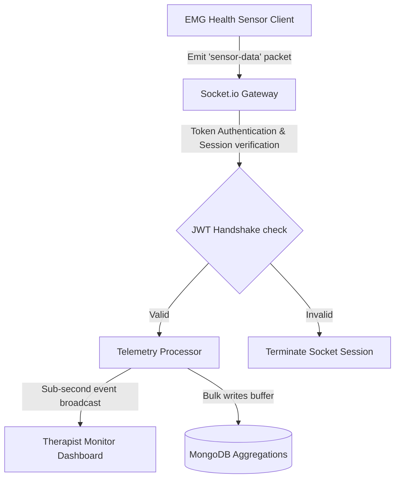

# R3aya Care System API: Real-Time Medical Telemetry & Hospital Management Engine

<div align="center">
  
</div>

<div align="center">
     
</div>

خادم **رعاية الطبي** هو محرك سحابي متكامل يعتمد على تقنيات الاتصال ثنائي الاتجاه الفوري (WebSocket) لنقل وتوثيق بيانات مستشعرات EMG الحيوية للمرضى، وتوفير لوحات تحكم طبية فورية للأطباء والمعالجين.

This repository houses the backend Node.js/Express API, real-time WebSocket communication pipelines, and database controllers for the **R3aya Care Telemetry System**. Designed to ensure sub-second latency for critical patient diagnostic streams.

---

## 🧬 Real-Time Telemetry Pipeline

The telemetry engine coordinates secure socket sessions and aggregates sensor readings:



---

## 🧬 Core Services & Layouts

1.  **WebSocket Controller (`src/sockets/`)**: Handles connection handshakes, room partitioning (patients vs. therapists), and heartbeat telemetry.
2.  **Telemetry Aggregations (`src/controllers/telemetry.js`)**: Aggregates raw EMG metrics into historical average trends.
3.  **Access Control Router (`src/routes/`)**: Secure routes protecting patient metadata via JWT and Role-Based Access Control (RBAC).

---

## 🛠️ Technology Stack & Assets

*   **Runtime Backend**: Node.js and Express.js REST APIs.
*   **Real-time Pipeline**: Socket.io running full-duplex communication protocols.
*   **Database Engine**: MongoDB with Mongoose ODM for fast, unstructured data collection.
*   **Access Protections**: JSON Web Tokens (JWT) verified at handshake level.

---

## 📂 Repository Module Layout

```text
r3aya-care-system-api/
├── src/
│   ├── config/          # Database connection details
│   ├── controllers/     # Health stats controllers and auth logic
│   ├── models/          # MongoDB schemas (Users, Scans, Records)
│   ├── routes/          # RESTful endpoint routes
│   ├── sockets/         # Socket.io event listeners and room configs
│   └── app.js           # Server initializer
├── package.json         # Project metadata
└── README.md            # System documentation
```

---

## ⚡ Local Setup & Run
```bash
git clone https://github.com/Sayed-Herzallah/r3aya-care-system-api.git
cd r3aya-care-system-api
npm install
# Set MONGO_URI and JWT_SECRET in config/.env
npm run dev
```

---

## 📄 License
Licensed under the **MIT License**.
